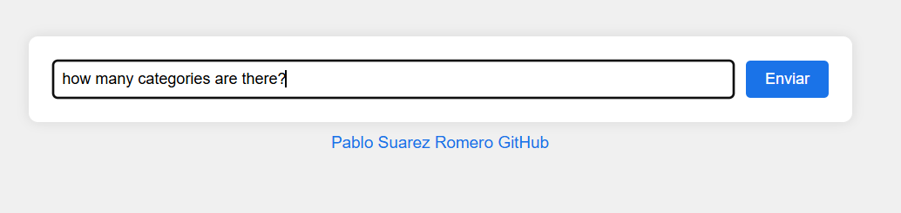
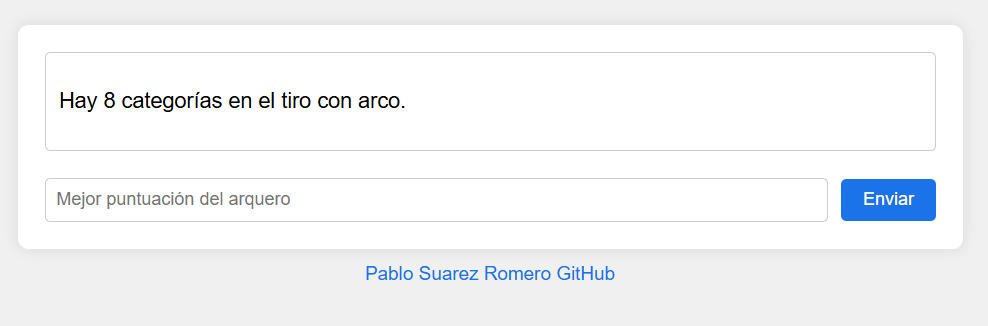
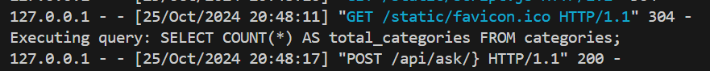

# Macaronesia Analyser
This project is a Flask application that interacts with Azure OpenAI and a MySQL database to process and analyze data.

The data comes from an archery league, with results in a PDF that we transform into JSON using Azure Form Recognizer, and then insert into a database.

With the data in a manageable format, we can perform a multitude of tasks. In this case, we use it to create custom queries and cross-reference new and old data.

By having the data structured in a MySQL database, we can leverage SQL's powerful querying capabilities to generate insights and reports. For example, we can:

- Track performance trends over time by comparing historical data with recent results.
- Identify top performers and underperformers based on various metrics.
- Generate detailed reports for individual archers or clubs.
- Cross-reference data to find correlations and patterns that might not be immediately obvious.

This flexibility allows us to make data-driven decisions and gain a deeper understanding of the archery league's dynamics.

Additionally, having the data in a database opens up possibilities for further integration with other tools and services, such as data visualization platforms, machine learning models, and more.

By using Azure OpenAI to generate SQL queries, we can automate complex data analysis tasks, making it easier to extract valuable insights without needing extensive SQL knowledge.

In summary, transforming the PDF data into a structured format and storing it in a database not only simplifies data management but also unlocks a wide range of analytical possibilities.

## Index

- [Introduction](#introduction)
- [Demo](#demo)
- [Main Files](#main-files)
- [Installation](#installation)
- [Run with Docker](#run-with-docker)
- [Transformation Flow](#transformation-flow)
    - [Why Use Azure Form Recognizer](#why-use-azure-form-recognizer)
    - [Key Benefits](#key-benefits)
- [Creating Queries with Azure OpenAI](#creating-queries-with-azure-openai)
    - [Steps to Create Queries with Azure OpenAI](#steps-to-create-queries-with-azure-openai)
    - [Example Usage](#example-usage)
    - [Limiting Hallucinations with Intermediate Queries](#limiting-hallucinations-with-intermediate-queries)
    - [Steps to Validate Queries with Azure OpenAI](#steps-to-validate-queries-with-azure-openai)
    - [Example Usage](#example-usage-1)


## Demo
In this demo, we will showcase the process of transforming a user's question into an SQL query using Azure OpenAI and then executing that query to obtain the desired results.

1. **User's Question**: The user starts by asking a question. For example, "How many categories are there?"
    

2. **Transformation to SQL**: Azure OpenAI processes the question and generates the corresponding SQL query based on the database schema.
    

3. **Result**: The generated SQL query is executed on the MySQL database, and the results are presented to the user.
    

This demo illustrates how we can leverage Azure OpenAI to automate complex data analysis tasks, making it easier to extract valuable insights from the data.


## Main Files

- **[app.py](app.py)**: Main file that starts the Flask server and defines the API routes.
- **[azureOpenAIClient.py](azureOpenAIClient.py)**: Client to interact with Azure OpenAI and generate SQL queries.
- **[mySqlClient.py](mySqlClient.py)**: Client to interact with the MySQL database.
- **[recognizer/](recognizer/)**: Contains scripts to process PDF and JSON files.
- **[Dockerfile.dockerfile](Dockerfile.dockerfile)**: Defines the Docker configuration for the project.
- **[requirements.txt](requirements.txt)**: List of project dependencies.
- **[schema.sql](schema.sql)**: MySQL database schema.

## Installation

1. Clone the repository:
    ```sh
    git clone <REPOSITORY_URL>
    cd <REPOSITORY_NAME>
    ```

2. Install the dependencies:
    ```sh
    pip install -r requirements.txt
    ```

> **Note**: You can see the required values in `.env-example`

## Run with docker

1. Build and start the Docker containers:
    ```sh
    docker-compose up --build
    ```

2. Check if the read-only user has been created in the MySQL database. You can do this by accessing the MySQL container.

3. If the read-only user does not exist, create it with the following commands:
    ```sql
    CREATE USER 'readonly_user'@'%' IDENTIFIED BY 'readonly_password';
    GRANT SELECT ON *.* TO 'readonly_user'@'%';
    FLUSH PRIVILEGES;
    ```

4. Access the application from your browser at `http://localhost:5000`.

To populate the database, ensure that the JSON files are located in the `/recognizer/json` directory and then access the following endpoint:

```sh
http://localhost:5000/api/process/json
```

## Transformation Flow

Initial Format: PDF

The initial format of the data is a PDF, usually consisting of 2 or more pages containing a table with the following data: name, club, 6 columns with points, the sum of the best three, and the total sum. For the application, we will omit the last two.With the PDF, you can start training your custom extraction model.

With the PDF in the `recognizer/pdf` folder, we can execute the Python script `main.py`. This script will call the Form Recognizer API, which returns a JSON with all detected data. From this JSON, we need to extract only the relevant data that matches our model.

> **Note**: Sometimes, the free tier of Azure Form Recognizer does not detect more than two pages at a time in a PDF. In these cases, you will need to split the PDF and send it in smaller parts.

At this point, we could insert the data into the database, but I prefer to keep a copy of the processed file to avoid reprocessing if needed. Therefore, we execute the script `saveInDatabase.py` or use the API endpoint `/api/process/json`. This will search for the files in `recognizer/json` in the database and insert them if they do not exist.

With this completed, we will have our PDF data in a MySQL database.


### Why Use Azure Form Recognizer

Azure Form Recognizer is a powerful and versatile tool that can significantly streamline the process of extracting data from documents. Depending on the size of your project, you can take advantage of the generous free tier, which offers ample usage for many applications.

### Key Benefits

- **Accuracy**: Form Recognizer uses advanced machine learning models to accurately extract text, key-value pairs, and tables from documents.
- **Efficiency**: Automates the data extraction process, reducing the time and effort required for manual data entry.
- **Scalability**: Easily scales to handle large volumes of documents, making it suitable for both small and large projects.
- **Integration**: Seamlessly integrates with other Azure services, such as Azure Storage and Azure Cognitive Services, to create a comprehensive data processing pipeline.
- **Customization**: Allows you to train custom models tailored to your specific document formats, improving extraction accuracy for specialized use cases.


## Creating Queries with Azure OpenAI

To avoid being limited by manually created queries, we use the Azure OpenAI API. Based on our database schema, the API generates a query to answer the user's question. Once we have the queries, we execute them. We can present this to the user or ask the API to explain the result by passing the question and the results.

### Steps to Create Queries with Azure OpenAI

1. **Obtain the Database Schema**: First, we need to obtain the schema of our MySQL database. This includes tables, columns, and data types.

2. **Send the User's Question to Azure OpenAI**: With the database schema and the user's question, we send a request to the Azure OpenAI API to generate an SQL query.

3. **Execute the SQL Query**: Once we have the generated SQL query, we execute it on our MySQL database.

4. **Present the Results to the User**: We can either show the results directly to the user or ask the Azure OpenAI API to explain the results.


### Example Usage

Suppose a user wants to know who the top archers in the last tournament are. The flow would be:

1. The user asks: "Who are the top archers in the last tournament?"
2. The Azure OpenAI API generates the SQL query based on the database schema.
3. We execute the query and obtain the results.
4. We present the results to the user or ask the API to explain the results.

This approach allows us to automate complex data analysis tasks and provide accurate and quick answers to user questions without requiring advanced SQL knowledge.

### Limiting Hallucinations with Intermediate Queries

To minimize the risk of hallucinations or incorrect SQL queries generated by Azure OpenAI, we can introduce an intermediate validation step. This involves asking Azure OpenAI to verify if the generated queries are likely to fulfill the user's request before executing them.

### Steps to Validate Queries with Azure OpenAI

1. **Generate the SQL Query**: As before, we generate the SQL query based on the user's question and the database schema.

2. **Validate the SQL Query**: Before executing the query, we ask Azure OpenAI to validate if the generated query is likely to fulfill the user's request.


3. **Execute the Query if Validated**: If the validation response is positive, we proceed to execute the query. Otherwise, we can refine the query or ask the user for more details.


### Example Usage

Suppose a user wants to know the average performance of archers over the last year. The flow would be:

1. The user asks: "What is the average performance of archers over the last year?"
2. Azure OpenAI generates the SQL query.
4. The query return an error on no results.
3. We validate the query with Azure OpenAI.
4. If validated, we execute the query and present the results to the user.

By incorporating this intermediate validation step, we can reduce the likelihood of executing incorrect or irrelevant SQL queries, thereby improving the accuracy and reliability of the responses provided to the users.